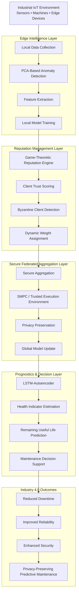

# FedSecurePdM

> **A Byzantine Fault-Tolerant and Privacy-Preserving Federated Learning Framework for Industrial Predictive Maintenance**

[]()
[]()
[]()
[]()

---

## Abstract

FedSecurePdM is a modular three-tier federated learning architecture designed for industrial predictive maintenance (PdM). The framework combines edge-level anomaly screening, a dynamic reputation engine, and secure aggregation mechanisms to improve robustness against Byzantine clients while preserving data privacy.

By integrating lightweight PCA-based detection, game-theoretic reputation weighting, and secure prognostic modeling, the framework enables reliable Remaining Useful Life (RUL) estimation under adversarial and non-IID industrial environments.

## Research Motivation

Traditional predictive maintenance solutions often rely on centralized data collection, introducing privacy risks, communication overhead, and vulnerability to malicious participants.

SecurePdM-FL addresses these challenges by combining Federated Learning with Byzantine fault-tolerant mechanisms, enabling secure and scalable predictive maintenance across distributed industrial infrastructures.

## ✨ Key Contributions
- Three-tier federated architecture for predictive maintenance
- Edge-based PCA anomaly screening
- Dynamic game-theoretic reputation mechanism
- Byzantine fault-tolerant model aggregation
- Privacy-preserving secure aggregation
- Robust operation under non-IID industrial environments
- Remaining Useful Life (RUL) prediction framework

## 🏗️ FedSecurePdM System Architecture



### Architecture Components

| Layer | Function | Technology |
|---------|---------|---------|
| Edge Intelligence | Local anomaly screening | PCA |
| Reputation Layer | Trust management | Game Theory |
| Aggregation Layer | Secure federated learning | SMPC / TEE |
| Prognostics Layer | HI & RUL prediction | LSTM-Autoencoder |
| Decision Layer | Maintenance recommendations | Predictive Analytics |

### Key Innovations

- Byzantine Fault-Tolerant Federated Learning
- Dynamic Reputation-Based Aggregation
- Edge-Level Anomaly Screening
- Privacy-Preserving Model Aggregation
- Health Indicator (HI) Estimation
- Remaining Useful Life (RUL) Prediction
- Industry 4.0 Deployment Readiness

## 📂 Repository Structure

```text
FedSecurePdM/

├── data/                 # Datasets
├── docs/                 # Documentation
├── experiments/          # Experimental setups
├── figures/              # Figures and diagrams
├── notebooks/            # Jupyter notebooks
├── results/              # Experimental outputs
├── src/
│   ├── edge/
│   ├── reputation/
│   ├── aggregation/
│   └── prognostics/
├── README.md
├── LICENSE
├── requirements.txt
└── CITATION.cff
```

⚙️ Installation

🚀 Quick Start

## 📊 Experimental Results

### Performance Under Byzantine Attacks

FedSecurePdM demonstrates strong resilience against malicious participants in federated environments.

| Byzantine Clients | FedAvg Accuracy | FedSecurePdM Accuracy |
|------------------|----------------|----------------------|
| 0% | 93.2% | 93.5% |
| 20% | 84.7% | 92.8% |
| 40% | 73.5% | 91.3% |
| 60% | 58.2% | 89.1% |

### RUL Prediction Performance

| Method | RMSE |
|----------|----------|
| Centralized Baseline | 12.4 |
| FedAvg | 18.6 |
| FedSecurePdM | 8.7 |

### Computational Overhead

| Component | Additional Cost |
|------------|----------------|
| PCA Screening | <1% |
| Reputation Engine | Low |
| Secure Aggregation | Moderate |
| Overall Framework | Practical for Edge Deployment |

### Key Findings

✅ Robust against up to 60% Byzantine clients

✅ Up to 76% reduction in worst-case RUL prediction error

✅ Negligible edge-side computational overhead

✅ Privacy-preserving distributed learning

✅ Suitable for Industry 4.0 deployment


## 📄 Related Publication

### FedSecurePdM: A Byzantine Fault-Tolerant and Privacy-Preserving Federated Learning Framework for Predictive Maintenance

**Authors:** Khalil Jahani, Behzad Moshiri, Babak Hossein Khalaj

**Venue:** *International Journal of Prognostics and Health Management (IJPHM)*

**Status:** Under Review (2026)

**Repository Role:** Official research implementation and reproducibility package.

## 📄 Future Work

- Adaptive thresholding and concept drift handling
- Explainable reputation diagnostics
- Differential Privacy integration
- FPGA/ASIC acceleration for secure aggregation
- Large-scale industrial deployment
- Digital twin validation
- Reinforcement Learning for maintenance scheduling
- Human-in-the-loop decision support


## 📖 Citation

If you use this work in your research, please cite:

```bibtex
@article{jahani2026fedsecurepdm,
  title={FedSecurePdM: A Byzantine Fault-Tolerant and Privacy-Preserving Federated Learning Framework for Predictive Maintenance},
  author={Jahani, Khalil and Moshiri, Behzad and Hossein Khalaj, Babak},
  journal={International Journal of Prognostics and Health Management},
  year={2026}
}

```

# 🗺️ Research Roadmap

```markdown
 🗺️ Research Roadmap

 Completed

- [x] PCA-Based Edge Screening
- [x] Reputation-Based Aggregation
- [x] Byzantine Robustness Evaluation
- [x] RUL Prediction Module

 In Progress

- [ ] Differential Privacy Integration
- [ ] Explainable Reputation Engine
- [ ] Large-Scale FL Simulation

 Future

- [ ] Reinforcement Learning for Maintenance Scheduling
- [ ] Digital Twin Integration
- [ ] Industrial Pilot Deployment
- [ ] FPGA-Accelerated Secure Aggregation

```

📜 License

## 📬 Contact

**Dr. Khalil Jahani**

📧 khalil.jahani@ee.sharif.edu

📧 jahanii@ut.ac.ir

🔗 Google Scholar

🔗 ORCID

🔗 ResearchGate
